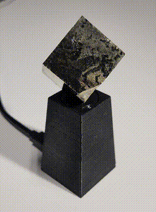
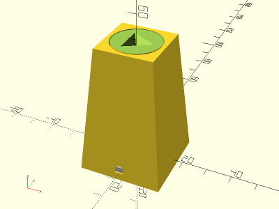
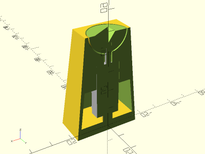

# Mini Turntable

<table>
<tr>
<td align="center"></td>
<td></td>
</tr>
<td></td>
<tr>
</tr>
</table>

A miniature motorized turntable for small objects, driven by a 10rpm 6V DC motor, powered by a USB connection. Made with OpenSCAD.

Direct wire and USB connector modes are supported. The direct wire mode leaves a cylinderical gap in the stand to pass through a wire for power. The USB connector mode is sized to fit a 0.8" by 0.45" USB micro-B breakout board.

**Design:** [mini_turntable.scad](mini_turntable.scad)

**STLs:**

* [turntable.cube.stl](stl/turntable.cube.stl)
* [turntable.ring.stl](stl/turntable.ring.stl)
* [stand.wire.stl](stl/stand.wire.stl)
* [stand.usb.stl](stl/stand.usb.stl)
* [base.wire.stl](stl/base.wire.stl)
* [base.usb.stl](stl/base.usb.stl)

**Recommended Print Settings:** 0.20mm layer height, default infill, no supports. All parts, except for the base, should be printed top-down.

**Parts Used**:

* 10rpm 6V DC motor - https://www.amazon.com/gp/product/B01ES98QSG/
* USB micro-B breakout board - https://www.amazon.com/gp/product/B09B1M4YLM/

**Thingiverse:** TBD

**License**: 
